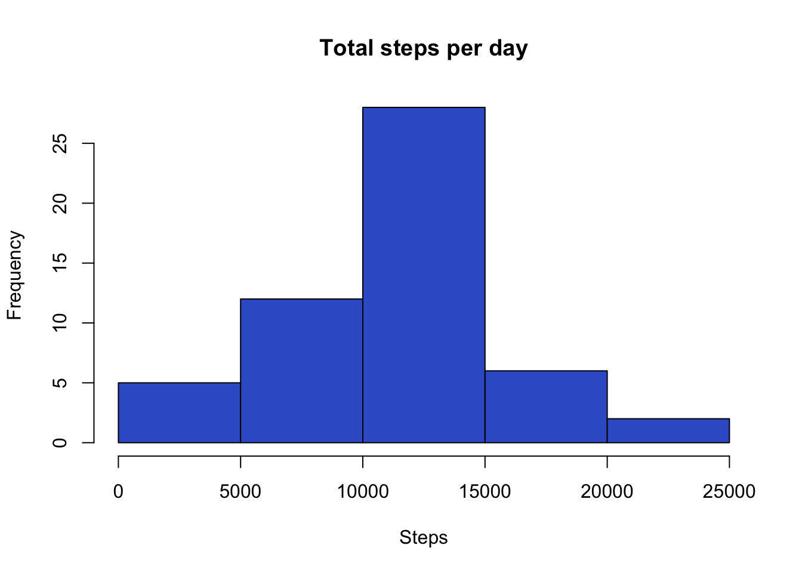
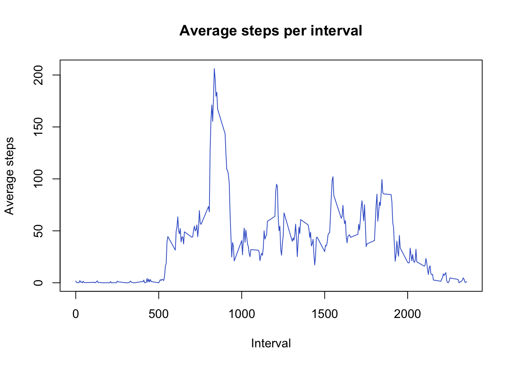
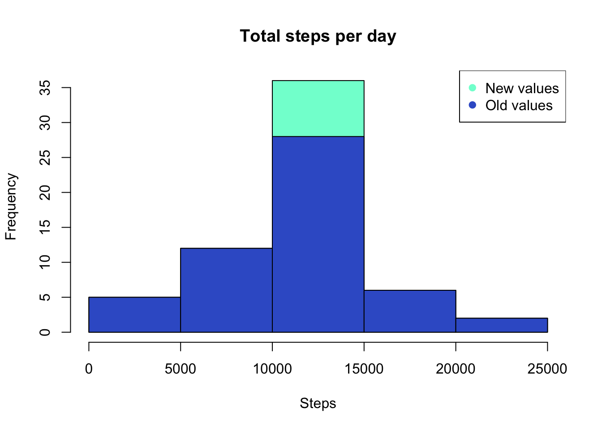
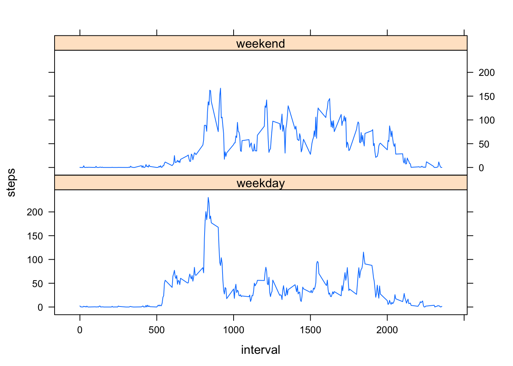

## Loading and preprocessing the data

Assuming that the data file is on the R Workspace:

```r
activity <- read.csv("activity.csv",header = TRUE)
```

## What is mean total number of steps taken per day?

Total number of steps per day

```r
stepsDay <- aggregate(steps ~ date,activity,sum)
hist(stepsDay$steps,xlab="Steps",main = "Total steps per day", col = "royalblue3")
```



Mean and median of total number of steps per day

```r
sMean <- mean(stepsDay$steps)
sMedian <- median(stepsDay$steps)
```

The mean is **1.0766189 &times; 10<sup>4</sup>** steps and the median **10765** steps        

## What is the average daily activity pattern?


```r
stepsInt <- aggregate(steps ~ interval,activity,mean)
plot(x=stepsInt$interval, y=stepsInt$steps,xlab="Interval", ylab="Average steps", main = "Average steps per interval", col = "royalblue3",type="l")
```



```r
maxSteps <- stepsInt[which(stepsInt$steps==max(stepsInt$steps)),]
```

The 5-min interval that contains the maximum number of steps is **835**, with **206.2** average steps.

## Imputing missing values


```r
totalNA <- sum(!complete.cases(activity))
```

The number of missing values on the dataset is **2304**

The following code replaces missing values with the average number of steps of the same interval:

```r
newActivity <- merge(x = activity,y = stepsInt,by = "interval",all.x = TRUE)
newActivity <- transform(newActivity, steps.x = ifelse(is.na(steps.x),steps.y,steps.x))
newActivity <- rename(newActivity,steps = steps.x)[,1:3]
```

New histogram creation to compare the difference after replacing missing values

```r
newStepsDay <- aggregate(steps ~ date,newActivity,sum)
hist(newStepsDay$steps,xlab="Steps",main = "Total steps per day", col = "aquamarine")
hist(stepsDay$steps,xlab="Steps", col = "royalblue3",add=T)
legend("topright",c("New values","Old values"),col = c("aquamarine","royalblue3"),pch = 19)
```



The histogram shows that after imputing missing values, the frequency of steps got higher for the interval between 10,000 and 15,000 steps.

### New mean and median calculation

```r
nMean <- mean(newStepsDay$steps)
nMedian <- median(newStepsDay$steps)
meanDiff <- nMean - sMean
medDiff <- nMedian - sMedian
```
The new mean is **1.0766189 &times; 10<sup>4</sup>** steps and the median **1.0766189 &times; 10<sup>4</sup>** steps.

The difference between both means is **0** and the median **1.1886792**.

##Are there differences in activity patterns between weekdays and weekends?

Creation of new factor variable **dayType** with a value of "weekday" or "weekend" based on the date

```r
wDay <- c("Monday","Tuesday","Wednesday","Thursday","Friday")
wEnd <- c("Saturday","Sunday")
aux <- weekdays(as.Date(newActivity$date,format="%Y-%m-%d"))
newActivity <- transform(newActivity,dayType = ifelse(aux %in% wDay, "weekday","weekend"))
```

Creation of plots differencing weekdays from weekends

```r
newStepsInt <- aggregate(steps ~ interval + dayType,newActivity,mean)
xyplot(steps ~ interval | dayType,data = newStepsInt, layout = c(1,2), type = "l")
```


